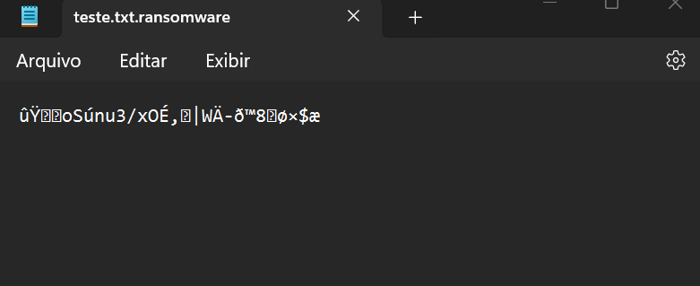
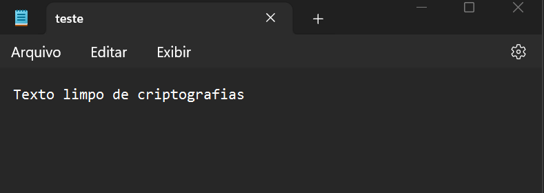

# Ransomware em Python 🛡️

### Descrição 

Este é um projeto de ransomware desenvolvido em Python para fins educacionais. Ele demonstra o funcionamento básico de um ransomware, incluindo a criptografia de arquivos usando o algoritmo AES. Este projeto destina-se exclusivamente para fins de aprendizado e conscientização sobre segurança cibernética.

### Ferramentas 🛠️

- Python
- PyAES

### Funcionalidades 🔒

- Criptografia de arquivos usando o algoritmo AES.
- Capacidade de criptografar e descriptografar arquivos.
- Implementação simples e clara em Python.

### Instruções de Uso ⚙️

1. Execute o script em um ambiente controlado.
2. Certifique-se de que os arquivos de teste adequados estão disponíveis. Você pode criar ou utilizar o arquivo no qual deseja aplicar o ransomware. 
4. Não utilize este software para fins maliciosos ou ilegais.

### Aviso Legal ⚠️

Este projeto é fornecido apenas para fins educacionais e de pesquisa. O autor não se responsabiliza pelo uso indevido ou malicioso deste software. Utilize-o por sua própria conta e risco.

### Resutados do arquivo Criptografado

### Resutados do arquivo Descriptografado

